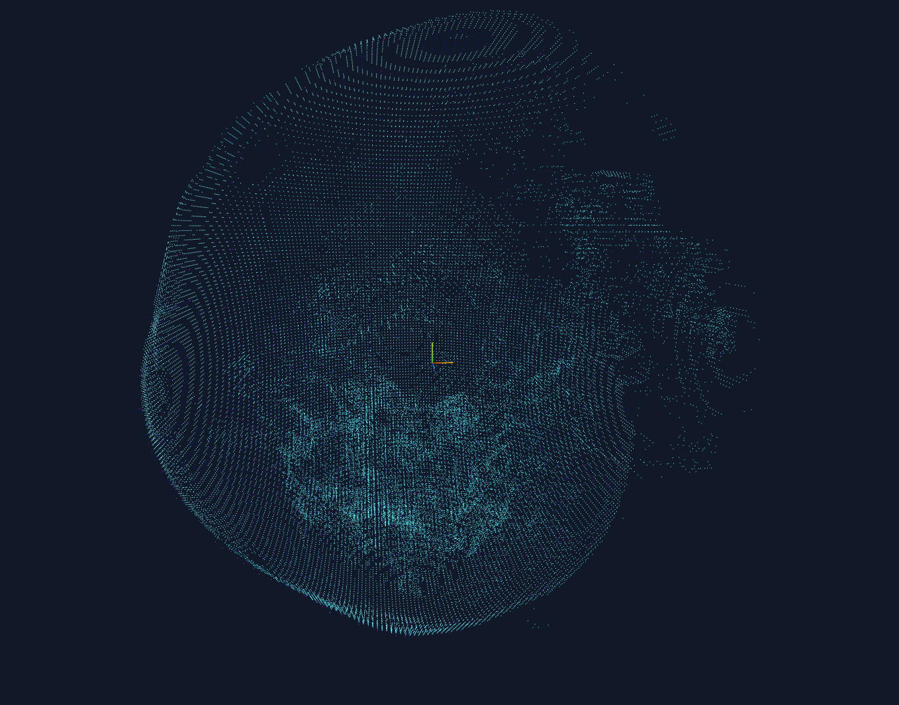
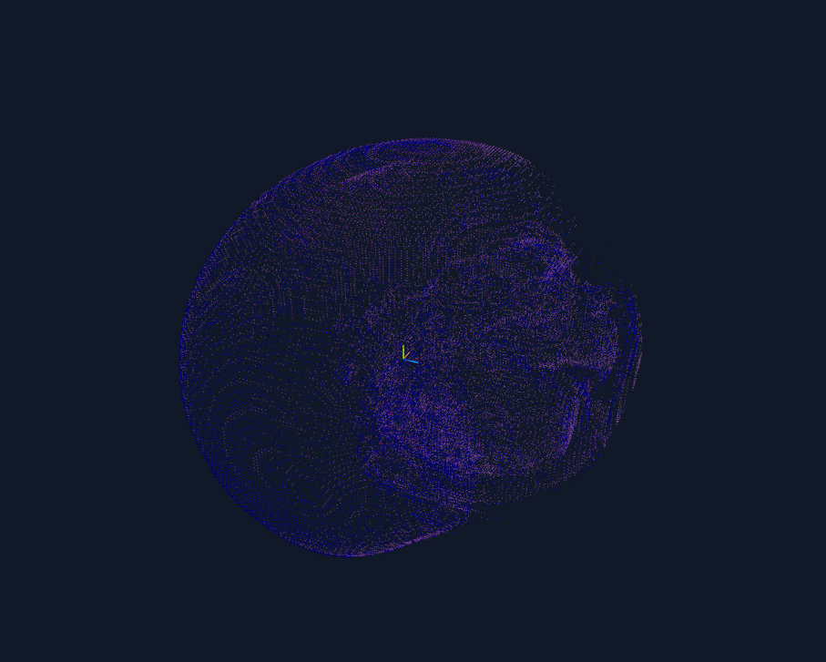
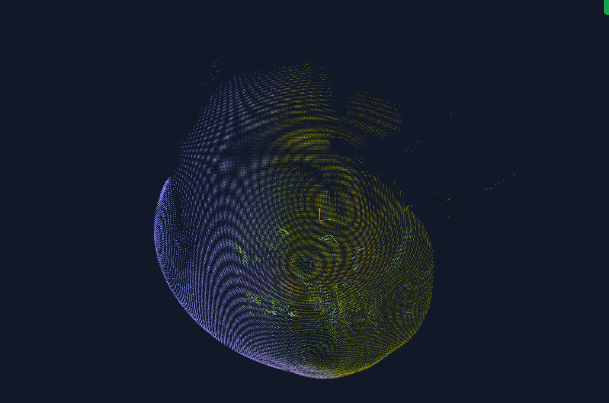

# VolSampler: Forging Sparse Representations from Volume

A Volume-to-Point Cloud tool for scientific visualization data (e.g., `.vti` format). It converts volumetric data into point clouds using various sampling strategies, facilitating subsequent tasks like 3D Gaussian Splatting (3DGS) training or other point cloud processing.

## Core Features

The core of this project lies in its **modular pipeline**:
`Reader` -> `Preprocess` -> `Sampler` -> `Writer`

You can freely combine different modules to process data. The most powerful feature currently is **Wavelet Transform-based Importance Sampling**, which automatically allocates sampling points based on volume features (edges, textures), proving more efficient than random sampling.

## Project Structure

The project adopts a layered architecture:

```text
VolSampler/
├── vol2pc/
│   ├── core/           # [Core] Defines basic data structures (Volume, PointCloud) and Pipeline interfaces
│   ├── io/             # [IO] Handles file reading (currently supports .vti)
│   ├── preprocess/     # [Preprocess] Data normalization, Transfer Function mapping (tf)
│   │   ├── tf.py       # Transfer Function implementation
│   │   └── low_level/  # Low-level accelerated operators (CUDA/Torch optimized)
│   ├── sampling/       # [Sampler] Core sampling algorithms
│   │   ├── wavelet.py  # Wavelet Sampler (WaveletSampler)
│   │   └── low_level/  # Low-level Wavelet Transform implementation (dwt3, sparsify)
│   ├── export/         # [Export] Handles result writing (currently supports .ply)
│   ├── cli.py          # [CLI] Command-line entry point, parses arguments and runs Pipeline
│   ├── config.py       # Configuration loading and parsing
│   └── registry.py     # Plugin registration mechanism
├── configs/            # Configuration examples (yaml)
├── datasets/           # Example datasets
├── examples/           # Demo scripts
└── tests/              # Unit tests
```

## Environment Setup

It is recommended to use `conda`:

```bash
conda create -n vol2pc python=3.9
conda activate vol2pc
pip install -r requirements.txt
# Or install this project directly
pip install -e .
```

Main dependencies: `numpy`, `torch`, `ptwt` (PyTorch Wavelet), `typer` (CLI), `pyyaml`.

## Quick Start

### 1. Command Line Interface (CLI)

This is the most common usage. You need to prepare a configuration file (`.yaml`). Please refer to `configs/`.

```bash
python -m vol2pc.cli run -c configs/your_config.yaml
```

To override input/output paths:

```bash
python -m vol2pc.cli run -i datasets/data.vti -c configs/your_config.yaml -o output.ply
```

### 2. Configuration Details

The configuration file is key. Here are typical scenarios:

#### Scenario A: Sampling based on frequency distribution of Density Volume (Density Only)

Refer to `configs/wl_density.yaml`. Use this if you only need to sample points based on density changes (without color, or just for geometric structure).

**Note**: Do **NOT** add `normalize` unless you are sure the TF requires normalized input.

```yaml
io:
  reader: vti

preprocess:
  # Original physical values -> [0,1]
  # - name: normalize 
  #   method: minmax

sampling:
  name: wavelet
  n_points: 50000    # Number of points
  wavelet: haar      # Wavelet basis, haar is fastest and most stable
  level: 3           # Decomposition levels, 3 is usually sufficient
  device: cuda       # Must use cuda

export:
  writer: ply
```



#### Scenario B: Sampling based on frequency distribution of RGBA Volume (TF)

Refer to `configs/wl_rgba.yaml`. This is key for visualization. Flow: `Density -> TF -> RGBA -> Wavelet Sampling`.
The resulting point cloud contains position, TF-mapped color, and opacity.

**Note:** If your TF domain is based on raw physical values (e.g., 0~100), do **NOT** enable `normalize` preprocessing, otherwise data will be squashed to 0~1, causing TF mapping failure (resulting in transparent background).

```yaml
io:
  reader: vti

preprocess:
  # 1. Normalize (Optional, depends on whether your TF is designed for raw values or 0-1)
  # - name: normalize
  #   method: minmax
  
  # 2. Apply Transfer Function
  - name: tf
    tf_json: "path/to/your_tf.json"  # Your TF config file
    device: cuda

sampling:
  name: wavelet
  n_points: 100000
  level: 3
  device: cuda

export:
  writer: ply
  path: results/your.ply
```



#### Scenario C: Sampling based on Gradient Distribution of Density Volume

Refer to `configs/g_density.yaml`.

```yaml
  io:
    reader: vti
    path: datasets/supernova_432x432x432_float32x.vti

  preprocess:
    - name: normalize
      method: minmax

  sampling:
    name: gradient
    n_points: 100000

  export:
    writer: ply
    path: results/supernova_density_gradient.ply
```



### TF JSON Format

`tf_json` must follow this format (control points list):

```json
{
  "control_points": [
    [ -12.0,  0.0, 0.0, 0.0, 0.0 ],
    [ 0.5,    1.0, 0.0, 0.0, 0.1 ],
    ...
  ]
}
```
Each row is `[Scalar_Value, R, G, B, Alpha]`.

## Developing New Plugins

Vol2PC uses a registry-based plugin system. All extended features (Reader, Stage, Sampler, Writer) should be implemented by inheriting base classes and registering them.

### 1. Inherit Base Class

Import the corresponding base class from `vol2pc.core.pipeline`:

*   `Reader`: File format reader
*   `Stage`: Preprocessing steps (Normalize, Filter, TF mapping)
*   `Sampler`: Sampling strategies (Random, Gradient, Wavelet)
*   `Writer`: Export format

### 2. Implement Core Logic

Example of developing a new `MySampler`:

```python
from typing import Dict, Any
from vol2pc.core.types import Volume, PointCloud
from vol2pc.core.pipeline import Sampler
from vol2pc.registry import register_sampler

class MySampler(Sampler):
    def sample(self, vol: Volume, cfg: Dict[str, Any]) -> PointCloud:
        # Get config parameters
        n_points = cfg.get("n_points", 1000)
        
        # Implement sampling logic...
        # Note: vol.data could be (Z,Y,X) single channel or (4,Z,Y,X) RGBA
        
        # Return PointCloud object
        return PointCloud(xyz=xyz_coords, attrs={"color": colors})

# 3. Register Plugin
# Important! CLI can only find it by name if registered.
register_sampler("my_sampler", MySampler)
```

### 3. Enable Plugin

Ensure your new file is imported. Usually, adding `from .my_sampler import MySampler` in `vol2pc/<subpackage>/__init__.py` allows the system to automatically scan and register it.
